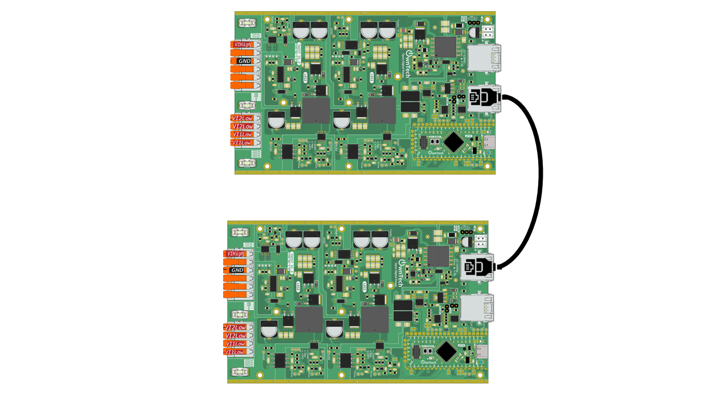

# Send information with analog communication

## Overview

Analog communication converts a discrete value into an analog value and sends information through the amplitude of a voltage.

This example will illustrate how to use analog communication to exchange information between two boards.

## Hardware setup and requirements



You will need :

- Two TWIST
- A power supply (10 to 100V, 30V preferable)
- A RJ45 cable

Connect the two twist with the RJ45, then supply the two twist with the DC supply.

## Software

The two boards have different roles, one is the server the other is the client. The server send the a value via analog communication and the client receive it.

### Server code

The server will send a sinewave varying  between 0 and 1. To flash the server make sure that line 44 is defined as :

```cpp
#define SERVER
```

We initalize the analog communication with :

```cpp
communication.analogCommunication.init();
communication.analogCommunication.setAnalogCommValue(2000);
```
`communication.analogCommunication.init()` will initialize the analog communication (DAC and ADC).

`communication.analogCommunication.setAnalogCommValue(2000)` send a numerical value (between 0 and 4096) to the DAC to convert it in analog voltage value (between 0 and 2.048V). 2000 represents a value of about 1V. Changing this numerical value also changes the voltage aplitude, thus making it possible to exchange information on analog bus.

The server is updating this value in the critical task, and sending the sinewave here :


```cpp
t = counter_sinus / (SAMPLE_RATE);
sine_ref = AMPLITUDE * sin(2 * PI * SIGNAL_FREQ * t) + 0.5; // Calcul de l'échantillon
counter_sinus++;
if(counter_sinus > num_samples) counter_sinus = 0;

communication.analogCommunication.setAnalogCommValue(sine_ref*4000);
```

### Client code

The client is following the same step but instead of sending values, it is receiving and reading it in the critical task :

```cpp
sine_ref_analog = communication.analogCommunication.getAnalogCommValue()/4000;
```

## Expected result

Use [ownplot](https://github.com/owntech-foundation/OwnPlot) and connect ir to the client. You should see the sinewave.
