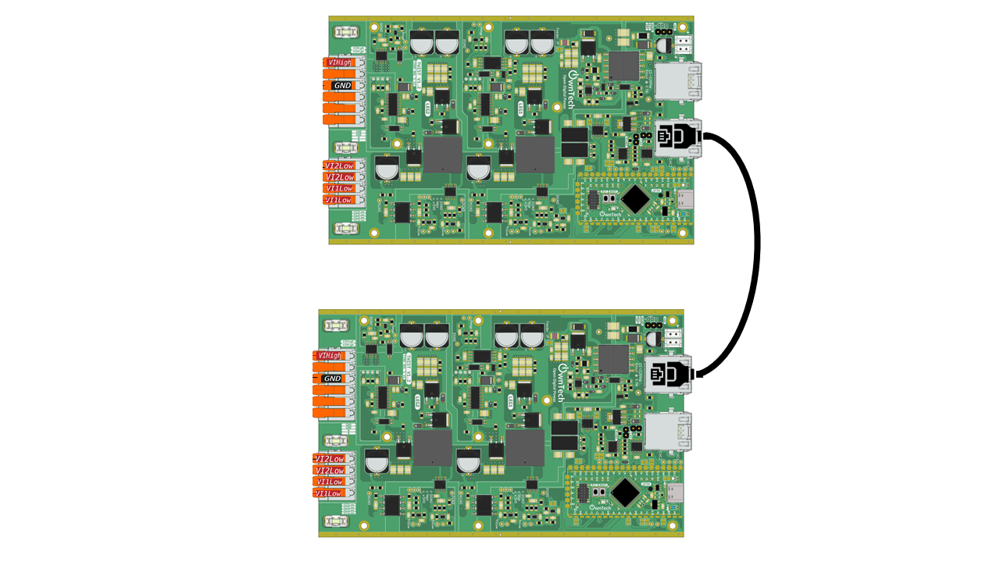

# Send information with rs485 communication

## Overview

RS-485 is a standard communication protocol used for serial communication over long distances in various industrial and commercial applications. It serves as a reliable method for transmitting digital data between multiple devices in a network. RS-485 enables robust and bidirectional communication, allowing for the exchange of information between devices such as sensors, controllers, and other peripherals.

In this example we will see how to use rs485 to send very precise information.

## Hardware setup and requirements



You will need :

- Two TWIST
- A power supply (10 to 100V, 30V preferable)
- A RJ45 cable

Connect the two twist with the RJ45, then supply the two twist with the DC supply.

## Software

The two boards have different roles, one is the server the other is the client. The server send the a value via rs485 communication and the client receive it.

### Server code

The server will send a sinewave varying  between 0 and 1. To flash the server make sure that line 44 is defined as :

```cpp
#define SERVER
```

We initalize the rs485 communication with :

```cpp
struct consigne_struct
{
    float32_t Sine_ref;    // sinewave reference
};

struct consigne_struct tx_consigne;
struct consigne_struct rx_consigne;

uint8_t* buffer_tx = (uint8_t*)&tx_consigne;
uint8_t* buffer_rx =(uint8_t*)&rx_consigne;

communication.rs485Communication.configure(buffer_tx, buffer_rx, sizeof(consigne_struct), reception_function, 10625000, true); // custom configuration for RS485 to have a 20Mbits/s speed communication
```

We have two structure, one for sending message (tx_consigne) and the other for receiving message (rx_consigne). You only need to work on these structures to use the rs485. Currently, these structures only contain one information wich is Sine_ref, but you can add more information in consigne_struct if you wish.

buffer_tx and buffer_rx are the pointer casted as uint8_t so that the DMA (direct access) can write/read directly on the structure.

The function rs485Communication.configure uses several parameter :
- e


### Client code

The client is following the same step but instead of sending values, it is receiving and reading it in the critical task :

```cpp
sine_ref_analog = communication.analogCommunication.getAnalogCommValue()/4000;
```

## Expected result

Use [ownplot](https://github.com/owntech-foundation/OwnPlot) and connect ir to the client. You should see the sinewave.
