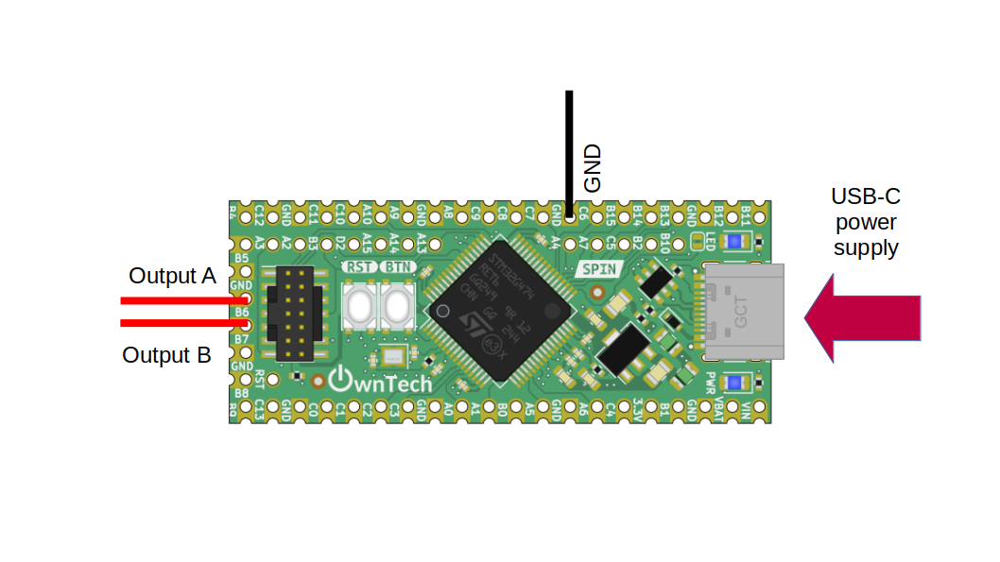

# Using the spin with an incremental encoder

An incremental encoder is a device that converts mechanical motion into digital signals. It typically consists of a rotating disk with evenly spaced slots and a sensor that detects these slots as the disk turns. The sensor generates electrical pulses corresponding to the motion, which can be used to track position, speed, or direction.

in this example we'll see how to use an incremental encoder with spin.


## Hardware setup and requirement



You will need :

- A spin
- A usb-c cable to supply the spin
- A rotary incremental encoder

Connect output A (clk) to gpio B6 and output B (dt) to gpio B7.

## Software setup

We initialize the incremental encoder :

```cpp
    spin.timer.startLogTimer4IncrementalEncoder();
```
The value from the incremental encoder is updated in the background task (called every 100ms). This value is displayed in the serial monitor.

## Expected result

You should see the value in the serial monitor either increasing or decresing depending on how you turning the rotary incremental encoder (clokc-wise or not).