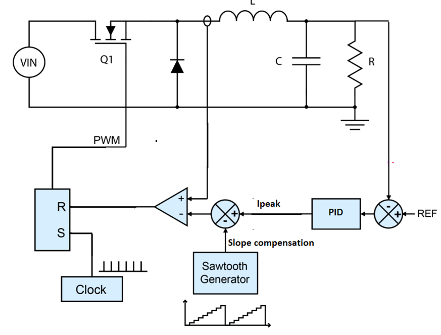

This branch is for testing the board in current mode.

Currently only buck configuration is supported for current mode.

```cpp
 /* Initialize buck with current mode*/
    twist.initAllBuck();
```

The function PID_CM initialize a PID to control the output voltage. The voltage reference `Vref` is initially 15V but you can increase it or decrease it from the serial monitor with `u` and `d`.

```cpp
float32_t PID_CM(float reference, float measurement)
{
    /////
    // Compute error

    float32_t error = reference - measurement;

    /////
    // Compute derivative term

    float32_t sum = (p * error) + integrator_mem;

    ////
    // Current reference
    float32_t Iref = 0;

    if (sum > 10)
        Iref = 10;
    else if (sum < -10)
        Iref = -10;
    else
        Iref = sum;

    /////
    // Compute integral term with anti-windup

    integrator_mem += ((Iref - sum) * Kb + i * error) * pid_period;

    return Iref;
}
```

#### Schematic
The general implementation of the current mode follow this model.


_Source : STM32 AN5497_

check [stm32 application note](https://www.st.com/resource/en/application_note/an5497-buck-current-mode-with-the-bg474edpow1-discovery-kit-stmicroelectronics.pdf) for more informations about current mode.

#### Important functions

For current mode, there are two specific functions to control the current of both legs.

```cpp
twist.setLegSlopeCompensation(LEG1, 1.4, 1.0);
twist.setLegSlopeCompensation(LEG2, 1.4, 1.0);
```

It sets in **volt** the higher and lower point of the sawtooth used for the slope compensation.
